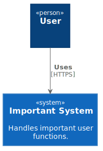
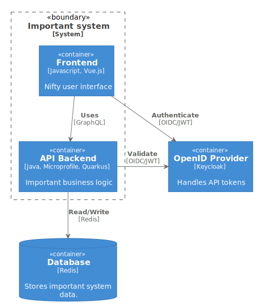

Example of a how one can use [Github Action](https://github.com/features/actions) to generate images on push from [PlantUML](https://plantuml.com/) files.

I made this particular diagram by using the modelling principles of [C4 Model](https://c4model.com/) and the PlantUML C4 stylesheet made by [Ricardo Niepel](https://github.com/RicardoNiepel/C4-PlantUML)

The github action can be found here [source](https://github.com/kdaham/plantuml-readme-example/blob/master/.github/workflows/plantuml-generator.yml)

## Important System - System Context

[PlantUML source](https://github.com/kdaham/plantuml-readme-example/blob/master/System_Context.puml)

## Important System - Container Overview

[PlantUML source](https://github.com/kdaham/plantuml-readme-example/blob/master/Container_Overview.puml)
